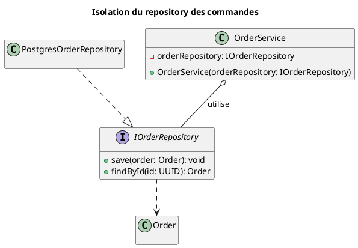

```plantuml
@startuml
title Isolation du repository des commandes

interface IOrderRepository {
  +save(order: Order): void
  +findById(id: UUID): Order
}

class PostgresOrderRepository

class OrderService {
  -orderRepository: IOrderRepository
  +OrderService(orderRepository: IOrderRepository)
}

class Order

PostgresOrderRepository ..|> IOrderRepository
OrderService o-- IOrderRepository : utilise
IOrderRepository ..> Order

@enduml
```

`OrderService` dépend uniquement de `IOrderRepository`. 