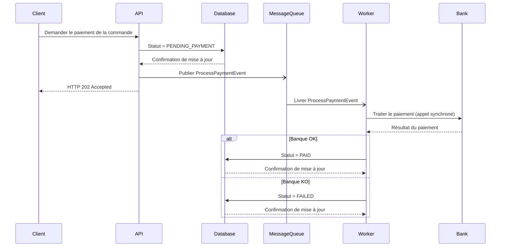
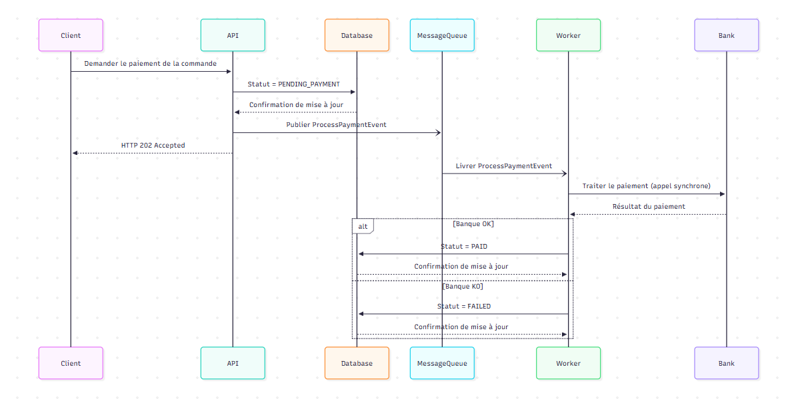

```mermaid
sequenceDiagram
    participant Client
    participant API
    participant Database
    participant MessageQueue
    participant Worker
    participant Bank

    Client->>API: Demander le paiement de la commande
    API->>Database: Statut = PENDING_PAYMENT
    Database-->>API: Confirmation de mise à jour
    API-)MessageQueue: Publier ProcessPaymentEvent
    API-->>Client: HTTP 202 Accepted

    MessageQueue-)Worker: Livrer ProcessPaymentEvent
    Worker->>Bank: Traiter le paiement (appel synchrone)
    Bank-->>Worker: Résultat du paiement

    alt Banque OK
        Worker->>Database: Statut = PAID
        Database-->>Worker: Confirmation de mise à jour
    else Banque KO
        Worker->>Database: Statut = FAILED
        Database-->>Worker: Confirmation de mise à jour
    end
```

